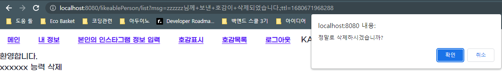
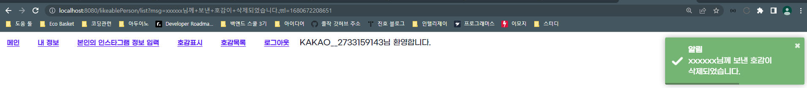

## Title: [1Week] 김진호

### 미션 요구사항 분석 & 체크리스트

---

**1. 필수미션 - 호감상대 삭제**

배경
- 현재 호감목록 기능까지 구현되어 있다.
    - 호감목록 페이지에서는 여태까지 본인이 호감을 표시한 상대방의 목록을 볼 수 있다.
- 현재 삭제버튼까지 구현되어 있다.

목표
- 호감목록 페이지에서 특정 항목에서 삭제버튼을 누르면, 해당 항목은 삭제되어야 한다.
    - 삭제를 처리하기 전에 해당 항목에 대한 소유권이 본인(로그인한 사람)에게 있는지 체크해야 한다.
- 삭제 후 다시 호감목록 페이지로 돌아와야 한다.
    - rq.redirectWithMsg 함수 사용

SQL
```SQL
DELETE
FROM likeable_person
WHERE id = 5;
```


---
**2. 선택미션 - 구글 로그인**

배경
- 현재 일반 로그인과 카카오 로그인까지 구현되어 있다.
  - 일반 회원의 providerTypeCode : GRAMGRAM
  - 카카오 로그인으로 가입한 회원의 providerTypeCode : KAKAO
  - 스프링 OAuth2 클라이언트로 구현되어 있다.
  - 카카오 개발자 도구에서 앱 등록, 앱으로 부터 앱키(REST API)를 받아서 프로젝트에 삽입하는 과정이 선행되었음
- 구글 로그인도 카카오 로그인 구현과정을 그대로 따라하면 된다.

목표
- 카카오 로그인이 가능한것 처럼, 구글 로그인으로도 가입 및 로그인 처리가 되도록 해주세요.
  - 스프링 OAuth2 클라이언트로 구현해주세요.
- 구글 로그인으로 가입한 회원의 providerTypeCode : GOOGLE

SQL
```SQL
# 최초로 구글 로그인을 통해서 가입이 될 때 실행되어야 할 SQL
# 구글 앱에서의 해당 회원번호를 2731659195 라고 가정
INSERT INTO `member`
SET create_date = NOW(),
modify_date = NOW(),
provider_type_code = 'GOOGLE',
username = 'GOOGLE__2731659195',
password = '',
insta_member_id = NULL;
```
---
**체크리스트** 

- [x] MariaDB 세팅
- [x] 시크릿 키(Kakao API KEY, Google API KEY, MariaDB 접속) 숨기기
- [x] 필수 미션
- [x] 선택 미션

### 1주차 미션 요약

---

**[접근 방법]**
- MariaDB 세팅
  - [스프링부트 45강 MariaDB 사용자 가이드](https://wiken.io/ken/12110)
- 시크릿 키 숨기기
  - Git에 API KEY를 노출하면 누군가 악용할 수 있기 때문에 숨기게 되었다.
    1. application.yml과 같은 디렉토리에 application-API-KEY.properties를 생성한다.
    2. application-API-KEY.properties 내에 프로젝트에서 사용할 API KEY들을 "Key=Value"형식으로 입력한다.
    3. Spring이 application-API-KEY.properties를 인식할 수 있도록 application.yml에 아래 코드를 추가한다.
        ```
       spring.profiles.include=API-KEY
       ```
    4. Git에서 API KEY가 노출되는 것을 방지하기 위해서 아래에 있는 API KEY 파일을 .gitignore에 추가한다.
       ```
        ### API KEY ###
        src/main/resources/application-API-KEY.properties
       ```
- 필수 미션(호감 삭제)
  - 점프투스프링부트 '3-10 수정과 삭제' 예제를 참고하여 호감 삭제 기능을 구현했습니다. 
    1. LikeablePersonController에서 URL로 전달받은 id값을 사용하여 LikeablePerson 데이터를 조회한 후 로그인한 사용자와 호감 표시를 한 멤버가 동일한 경우 서비스의 delete 메서드로 호감을 삭제한다. 호감 데이터 삭제 후에는 호감 목록 화면으로 돌아갈 수 있도록 rq.redirectWithMsg 함수를 사용해서 리다이렉트 한다.
    2. LikeablePersonService에서 입력으로 받은 LikeablePerson 객체를 사용하여 호감을 삭제하는 delete 메서드를 추가했다.
    3. 결과물1
    
    4. 결과물2
    

- 선택 미션(구글 로그인)
  - Google Cloud Platform에서 API KEY 받아서 application.yml에 코드 추가 프로젝트 생성
    1. GCP에서 새 프로젝트 생성
    2. API 및 서비스 - 사용자 인증 정보에서 사용자 인증 정보 만들기(OAuth 클라이언트 ID)
    3. scope 업데이트, redirect URL 입력
    4. OAuth 클라이언트 ID, Secret 복사
    5. application.yml에 추가
    

**[리팩토링]**
피어리뷰를 통해 "호감 삭제 기능에서 너무 컨트롤러에서 많은 것들을 처리한다. 이것을 서비스와 나누고 복잡한 로직은 서비스에 두는 것이 좋다." 라는 피드백을 받아서 
컨트롤러와 서비스에 로직을 나누어서 리팩토링을 진행했다.
그리고 Rq 클래스는 컨트롤러에서만 다루는 것이 좋다.
